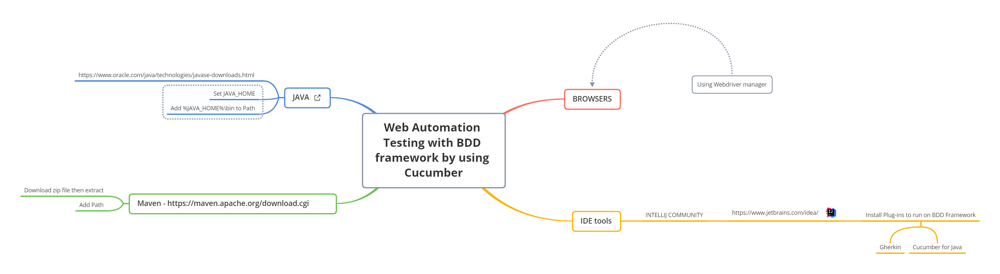

# Vuong Phan

BDD Test Automation Framework by using Cucumber
- Maven
- Data Driven Testing
- Page Object Model
- JUnit
- Maven Cucumber reporting

  
## Set up .
1. Install and setup [Java JDK](http://www.oracle.com/technetwork/java/javase/downloads/index.html)
2. Download and setup [Maven](https://maven.apache.org/download.cgi)
3. Install [Intellij Community](https://www.jetbrains.com/idea/download)

## Description
- The scenarios are in .feature files of resources package
- The steps of scenario is defined in stepsDefinitions package
- The located elements is saved to separate file in pageObjects package
- The TestRunner files to run Junit test with configured 

## How to run
1. Run manually in IntelliJ tool
- Run the .feature file 
- or run by TestRunner file in runners folder

2. Run by commandline 
```batch
mvn clean verify -Dcucumber.filter.tags="@Create"
mvn clean verify -Dcucumber.features="src/test/resources/test.feature:15"
...
```
## How to generate the report
```batch
mvn clean verify
```

## Post-conditions
```batch
It's defined in Hooks.class
```
Example:
- Perform to clean the data after test

## Where are reports
```
target/cucumber-html-reports
```

